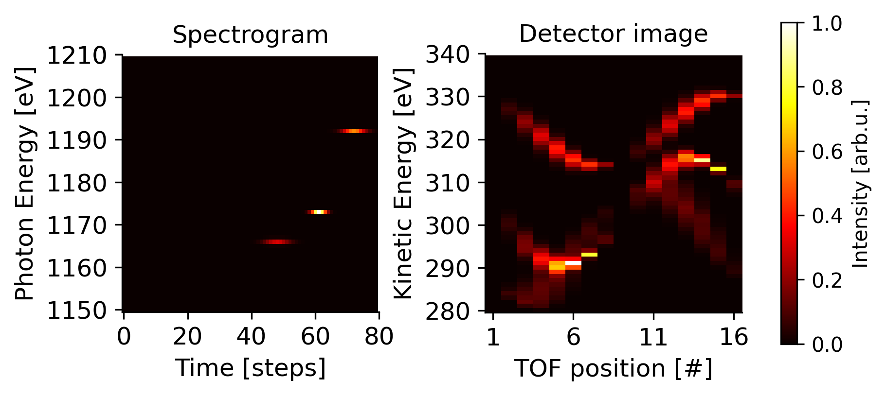
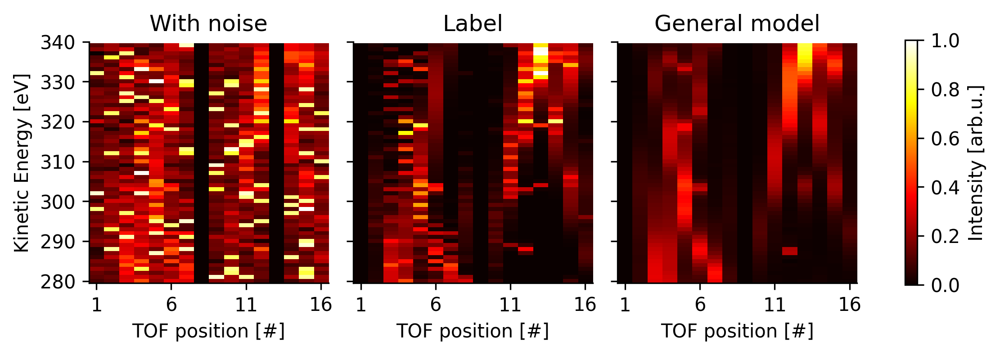

# Time of Flight Detector Denoising and Reconstruction
<a href="https://pytorch.org/get-started/locally/"></a>

A deep-learning based online denoising and reconstruction method for time of flight (TOF) detectors in PyTorch.





# Quick Start

```py
from evaluation import Evaluator

# Initialize evaluator
e: Evaluator = Evaluator({}, output_dir="outputs/", load_max=0)
# Create spectrogram with 3 peaks with seed 12 and simulate detector image
e.plot_spectrogram_detector_image(3, 12)

# Initialize evaluator with General model
model_dict = {
     "General model": "outputs/tof_reconstructor/hj69jsmh/checkpoints"}
e: Evaluator = Evaluator(model_dict, output_dir="outputs/", load_max=10)

# Disable TOF detectors on position #8 and #13
e.plot_reconstructing_tofs_comparison([7, 12], "General model")
```

# Citation

If you find this useful in your research, please consider citing:

[Reconstructing Time-of-Flight Detector Values of Angular Streaking Using Machine Learning.](https://doi.org/10.48550/arXiv.2501.08966)

    @misc{meier2025reconstructingtimeofflightdetectorvalues,
      title={Reconstructing Time-of-Flight Detector Values of Angular Streaking Using Machine Learning}, 
      author={David Meier and Wolfram Helml and Thorsten Otto and Bernhard Sick and Jens Viefhaus and Gregor Hartmann},
      year={2025},
      eprint={2501.08966},
      archivePrefix={arXiv},
      primaryClass={physics.data-an},
      url={https://arxiv.org/abs/2501.08966}, 
}
